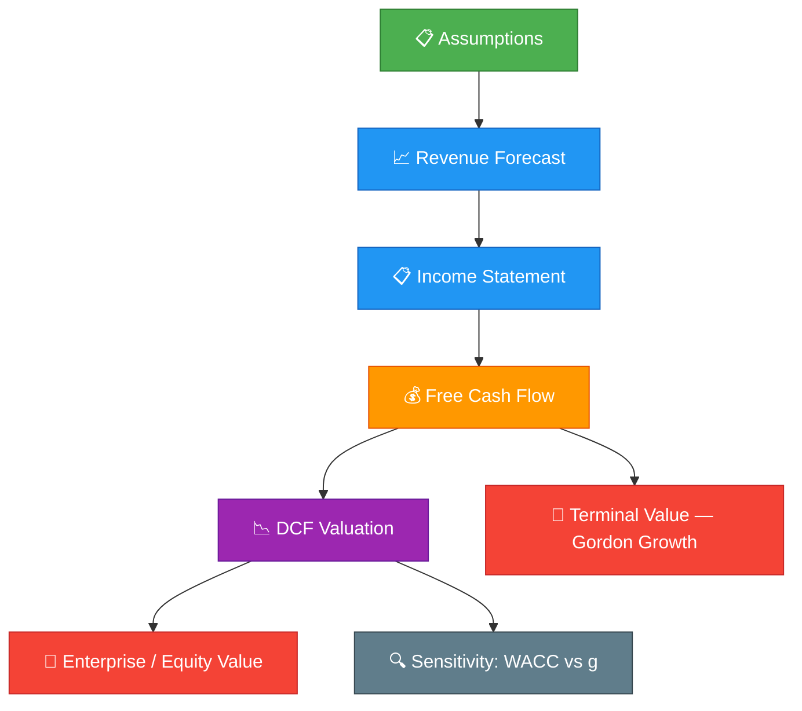

<div align="center">

# 🧠 AI Chip DCF Valuation Model

**A fully dynamic Discounted Cash Flow model tailored for the AI chip industry**

*Three macro-demand scenarios · Formatted Excel output · Two-way sensitivity analysis*

---


</div>

---

## ✦ Overview

> *Bridging quantitative finance and semiconductor market intelligence.*

This project delivers a **production-grade DCF valuation framework** purpose-built for the AI chip industry. It projects five years of financial statements (2026–2030), discounts free cash flows to the firm (FCFF), and computes enterprise & equity value under three demand scenarios — all exported to a cleanly formatted Excel workbook with conditional formatting and sensitivity tables.

### 🎯 Key Highlights

| Feature | Description |
|:-------:|-------------|
| 🎭 **Tri-Scenario Engine** | Bear / Base / Bull cases with independently tuned operating assumptions |
| 📊 **Full P&L Projection** | Revenue → Gross Profit → EBITDA → EBIT → NOPAT chain |
| 💰 **FCFF Construction** | D&A add-back, CapEx, ΔNWC → unlevered free cash flow |
| 📉 **Gordon Growth Terminal** | Perpetuity-based terminal value with configurable growth rate |
| 🔍 **Two-Way Sensitivity** | WACC (8%–14%) × Terminal Growth (1%–4%) heatmap |
| 📦 **One-Command Output** | Single `python dcf_model.py` → ready-to-present `.xlsx` |

---

## 📑 Table of Contents

- [📊 Model Architecture](#-model-architecture)
- [🎭 Three Scenarios](#-three-scenarios)
- [📁 File Structure](#-file-structure)
- [🚀 Quick Start](#-quick-start)
- [📈 Excel Output](#-excel-output)
- [⚙️ Customization](#-customization)
- [📦 Dependencies](#-dependencies)
- [🗺️ Roadmap](#-roadmap)
- [📄 License](#-license)
- [🌟 Contributing](#-contributing)

---

## 📊 Model Architecture



The model projects **5 years of financials (2026–2030)** and discounts the resulting free cash flows to firm (**FCFF**). Terminal value is calculated using the **Gordon Growth Model**.

<details>
<summary><b>📐 Detailed FCFF Calculation Flow</b></summary>

```
Revenue
  − COGS
─────────────────
Gross Profit
  − Operating Expenses (SG&A, R&D)
─────────────────
EBITDA
  − Depreciation & Amortization
─────────────────
EBIT
  × (1 − Tax Rate)
─────────────────
NOPAT
  + D&A
  − CapEx
  − Δ Net Working Capital
─────────────────
FCFF (Free Cash Flow to Firm)
```

Each year's FCFF is discounted by the weighted average cost of capital (WACC), and a terminal value captures all cash flows beyond the explicit forecast horizon.

</details>

---

## 🎭 Three Scenarios

<div align="center">

| | 🐻 **Bear** | 🏔️ **Base** | 🐂 **Bull** |
|:---|:---:|:---:|:---:|
| **Description** | Slow AI adoption, competition & margin pressure | Balanced growth, steady market share | Explosive AI demand, premium pricing |
| **Revenue CAGR** | `10%` | `25%` | `40%` |
| **Gross Margin** | `55%` | `60%` | `65%` |
| **Key Driver** | Weak hyperscaler demand | Enterprise AI expansion | AGI breakthroughs & sovereign AI |

</div>

<br>

> 💡 All scenarios independently adjust **operating expenses**, **D&A**, **CapEx intensity**, and **working capital** to reflect the underlying operating environment — not just a revenue tweak.

---

## 📁 File Structure

```
ai-chip-dcf-model/
│
├── 📄 dcf_model.py              # Python script — generates the Excel model
├── 📊 AI_Chip_DCF_Model.xlsx    # Output Excel workbook (generated after run)
├── 📦 requirements.txt          # Python dependencies
├── 📝 README.md                 # You are here
└── 📜 LICENSE                   # MIT License
```

---

## 🚀 Quick Start

### 1 · Clone the repository

```bash
git clone https://github.com/your-username/ai-chip-dcf-model.git
cd ai-chip-dcf-model
```

### 2 · Install dependencies

```bash
pip install -r requirements.txt
```

### 3 · Run the model

```bash
python dcf_model.py
```

<div align="center">

✅ The script will output **`AI_Chip_DCF_Model.xlsx`** in the current directory.

</div>

---

## 📈 Excel Output

The generated workbook contains **four sheets**, each tailored for analysis and presentation:

| Sheet | Content | Format |
|:-----:|---------|:------:|
| `Bear_DCF` | Full P&L, cash flow & DCF under Bear scenario | Formatted |
| `Base_DCF` | Same structure for Base case (25% CAGR) | Formatted |
| `Bull_DCF` | Bull scenario valuation | Formatted |
| `Sensitivity` | Two-way table: WACC (8%–14%) × Terminal Growth (1%–4%) | Heatmap |

<details>
<summary><b>📋 What's inside each DCF sheet</b></summary>

<br>

**Income Statement Chain**
> Revenue → Gross Profit → EBITDA → EBIT → NOPAT

**Cash Flow Adjustments**
> Depreciation add-back · CapEx · ΔNWC

**Valuation Block**
> FCFF for 2025–2030 · Discount factors · PV of cash flows · Terminal Value · Enterprise Value · Equity Value

**Sensitivity Sheet**
> Uses Base-case cash flows · Red-Yellow-Green conditional color scale

</details>

---

## ⚙️ Customization

All assumptions live at the top of `dcf_model.py` — no hunting through code:

```python
scenario_params = {
    'Base': {
        'cagr': 0.25,           # Revenue CAGR
        'gross_margin': 0.60,   # Gross margin
        'opex_pct': 0.18,       # Opex as % of revenue
        'capex_pct': 0.12,      # CapEx intensity
        'da_pct': 0.08,         # D&A as % of revenue
        'nwc_pct': 0.15,        # NWC as % of revenue
        'tax_rate': 0.21,       # Effective tax rate
    },
    # ... Bear & Bull similarly
}

# Global parameters
WACC = 0.10              # Weighted Average Cost of Capital
TERMINAL_GROWTH = 0.025  # Gordon Growth perpetuity rate
FORECAST_YEARS = 5       # Explicit forecast horizon
```

---

## 📦 Dependencies

| Package | Purpose | Min Version |
|:-------:|---------|:-----------:|
| 🐍 Python | Runtime | 3.9+ |
| 📊 openpyxl | Excel workbook generation & formatting | latest |

```bash
# requirements.txt
openpyxl>=3.1.0
```

---

## 🗺️ Roadmap

- [x] Tri-scenario DCF with FCFF construction
- [x] Gordon Growth terminal value
- [x] Two-way sensitivity table with color scale
- [x] Formatted Excel output
- [ ] Monte Carlo simulation module
- [ ] Comparable company analysis (Comps)
- [ ] Interactive dashboard (Streamlit / Dash)
- [ ] Multi-currency support

---

## 📄 License

This project is licensed under the **MIT License** — feel free to use, modify, and distribute.

> See [`LICENSE`](./LICENSE) for the full text.

---

## 🌟 Contributing

Pull requests are welcome! For major changes, please open an issue first to discuss what you would like to change.

1. Fork the repository
2. Create your feature branch (`git checkout -b feature/amazing-feature`)
3. Commit your changes (`git commit -m 'Add amazing feature'`)
4. Push to the branch (`git push origin feature/amazing-feature`)
5. Open a Pull Request

---

<div align="center">

---

**Built with ❤️ for AI chip valuation enthusiasts**

*If this project helped you, consider giving it a ⭐*

[🔼 Back to Top](#-ai-chip-dcf-valuation-model)

</div>
